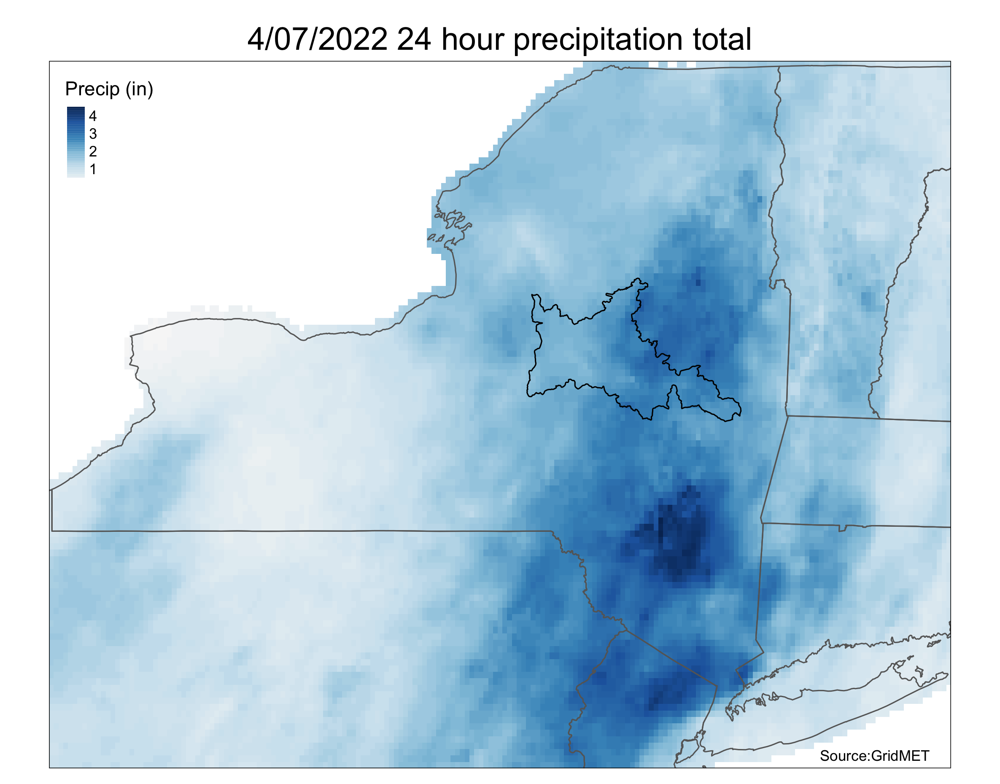
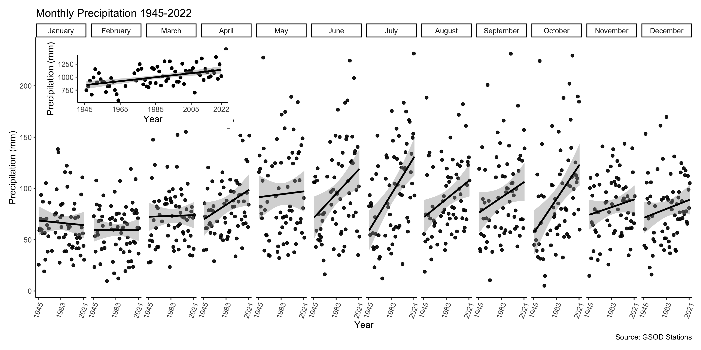

# Flooding of the Mohawk River In Schenectady, NY on April 8th, 2022
While I have a lot of nice images and clips in my twitter thread, it is lacking in context as to what actually triggered this flooding event. On the night of April 7th, 2022, the Mohawk Valley and surrounding region saw significant rainfall. This figure I produced shows some of the spatial extent of this intense rainfall. 

 

 
 
<em> Map of the April 7th-8th rainfall event in New York. The Mohawk Watershed is outlined in black. </em>

 
As you can see, much of the rainfall actually occurred upstream from Schenectady. However, as we know, watersheds are additive. The intense rainfall inundated streams across the region, most of which feed the Mohawk. Since there is a natural lag time in river systems, it wasn’t until the next day that Schenectady saw flooding. I awoke around 8:30 AM to some reports of the Mohawk overtopping its banks near Union College. I was finally able to take a look myself around 11:30 AM. 

<blockquote class="twitter-tweet">
Flooding of the Mohawk at Freeman’s Bridge. <a href="https://twitter.com/USGS?ref_src=twsrc%5Etfw">@USGS</a> is out here presumably gauging. <a href="https://t.co/qX3Fa4oJJB">pic.twitter.com/qX3Fa4oJJB</a>
&mdash; Ian Plummer🇮🇹🏴󠁧󠁢󠁷󠁬󠁳󠁿 (@plumquat) <a href="https://twitter.com/plumquat/status/1512452263863803906?ref_src=twsrc%5Etfw">April 8, 2022</a></blockquote> 

I know that there is little reference to the severity of this flooding in those images so i’ll include some actual numbers here. At Freeman's Bridge (the location of those photos) the usual height of the river is usually between 10-15 feet, in that photo the river height is nearly 22 ft. 

A little bit up-river in the Stockade District, where flooding is a common issue, the river rose at-least 4-5 feet and overtook a water front park. It should be noted that this was nowhere near the worst flood to affect this district, but it was still remarkable. 

<blockquote class="twitter-tweet">
Flooding on N Ferry St in the Stockade. River height is usually 4-5 feet bellow the street level. <a href="https://t.co/PcG845dHUI">pic.twitter.com/PcG845dHUI</a>
&mdash; Ian Plummer🇮🇹🏴󠁧󠁢󠁷󠁬󠁳󠁿 (@plumquat) <a href="https://twitter.com/plumquat/status/1512455937235329029?ref_src=twsrc%5Etfw">April 8, 2022</a></blockquote> 

Going back to my comment about the lag time between rainfall and large river systems, the levels of the Mohawk in Schenectady were still rising by 2:50 PM, at least 9-10 hours after the rain stopped. 

Luckily all passed without much incident. Many folks I talked with in the Stockade District were concerned about the encroaching water, but shared stories about how much worse the flooding from Hurricane Irene was. 

We have obseverved that precipitation in the watershed is increasing on annual and seasonal timescales. Spring, summer, and fall precipitation has increased in the last 80 years. Furthermore, there has been a [rise of extreme rainfall](https://mohawk.substack.com/p/extreme-rainfall-in-the-northeast) events across the watershed. The increase in precipitation has been driving, and will continue, to drive flooding events like this in the watershed.

 

<em> Monthly precipitation from 9 stations across the watershed. Statistically significant increases are occuring in most months except for the winter. </em>

This event serves as an excellent reminder of how interconnected our waterways are. Every action humans take, especially upriver, will impact hundreds to thousands of communities downriver. The Mohawk and Hudson were essentially used as waste disposal systems in the 19th and early 20th century. There is still ongoing research trying to quantify the damage of industrial waste disposal into the Mohawk. Regardless of the action of the past, it is clear that there is need for greater cooperation and communication between communities and entities around the river as we move into an uncertain future. 

