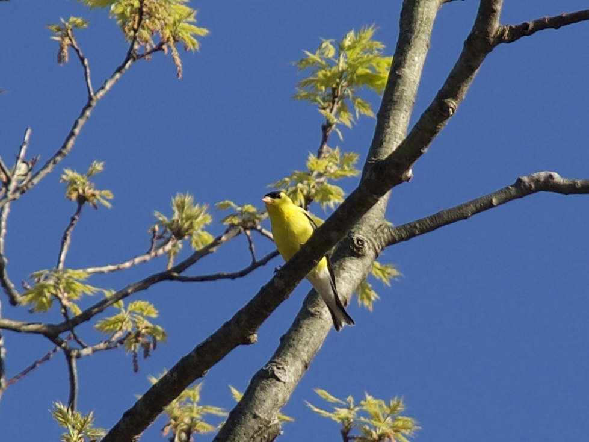
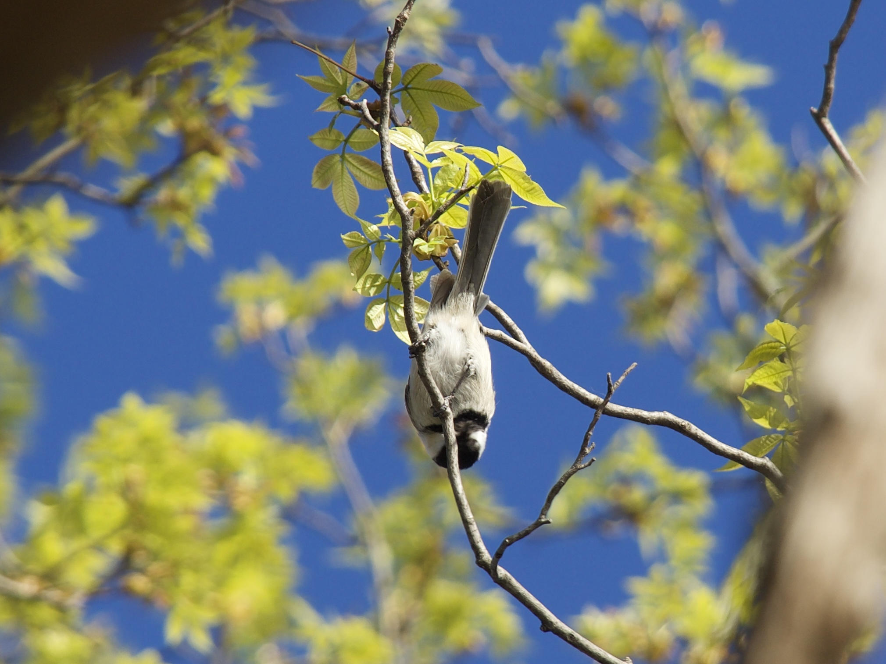
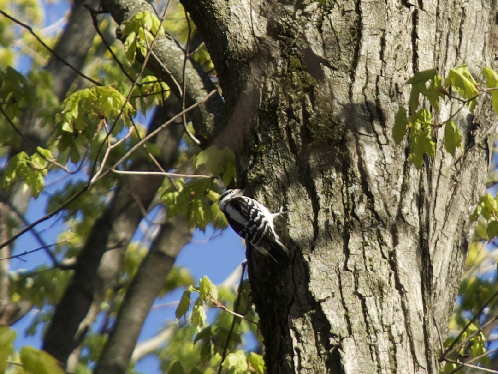
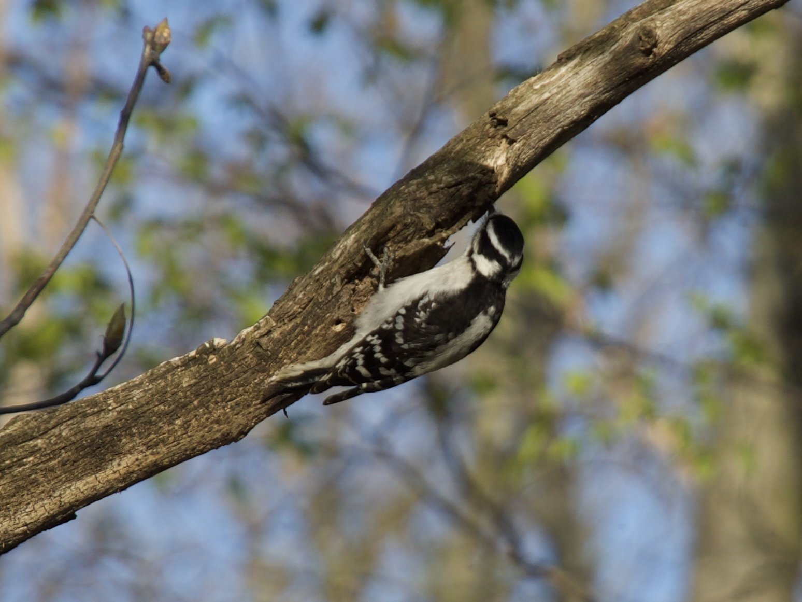
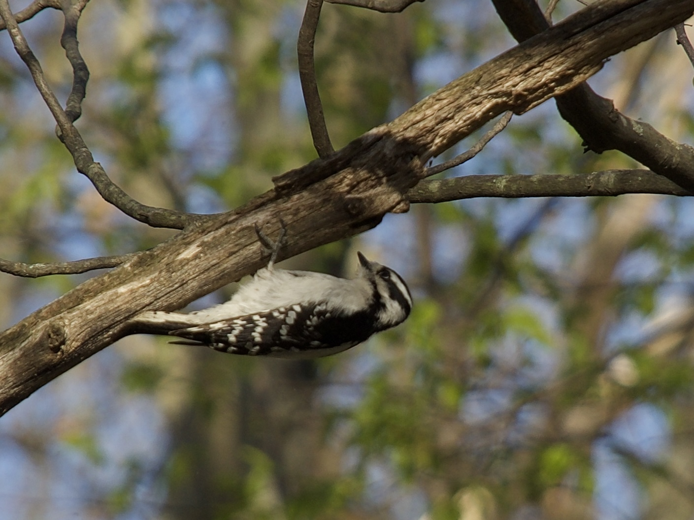
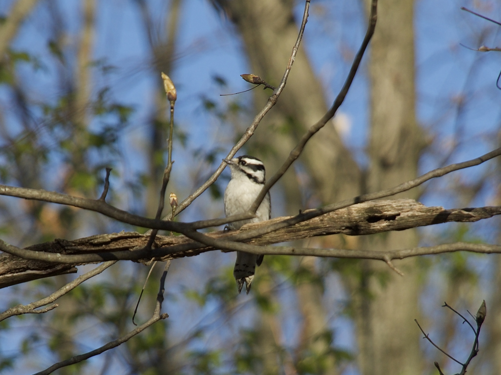

Welcome to the bird blog! This is a collection of bird pictures I have accumulated over the years and will periodically update. I have organized it alphabetically by the common name of the bird. Right click on the images to open them in full resolution.

## American Goldfinch 
<em> Spinus tristis </em> from Spinus (an Ancient Greek word for finch) and the Latin tristis for sad/sorrowful. This is a common botanical and zoological epithet for muted colors or, in this case, a reference to the dull plumage displayed in the winter compared to its bright summer yellow.

<em> Adult Male - Peebles Island State Park, Cohoes, NY [4/24/26} </em>

## Bald Eagle 
<em> Haliaeetus leucocephalus </em> from the Greek hali (sea), aeetos (eagle), leukos (white), and cephalos (head). 

 

<em> Adult-Peebles Island State Park, Cohoes, NY [4/24/26} </em>

<em> Juvenile - Green Island, NY [4/23/26} </em>

## Black-capped Chickadee
<em> Poecile atricapillus </em> from the Greek poikil (spotted or many-colored) and the Latin ater (black) and capillus (hair, particularly of the head).

<em> Adult - Peebles Island State Park, Cohoes, NY [4/24/26} </em>

  
## Blue Dacnis

<em> [Left] Male - PETAR, Iporanga, Sao Paulo, Brazil [8/10/23} </em>

## Blue Jay

## Downy Woodpecker
<em> Dryobates pubescens </em> from the Greek drus (tree or woodland) and bates (walker or treader) and the Latin pubescens (covered in short hair i.e. downy)

 

 

<em> Adult Female (eastern) - Peebles Island State Park, Cohoes, NY [4/24/26} </em>

## Eastern Bluebird

## Eurasian Coot 

## Green-headed Tanager

<em> [Right] Adult - PETAR, Iporanga, Sao Paulo, Brazil [8/10/23} </em>

  
## Mallard

## Mourning Dove

## Northern Yellow Warbler 

## Osprey

## Red-winged Blackbird

## Spot-biled Toucanet

## Yellow-rumped Warbler
