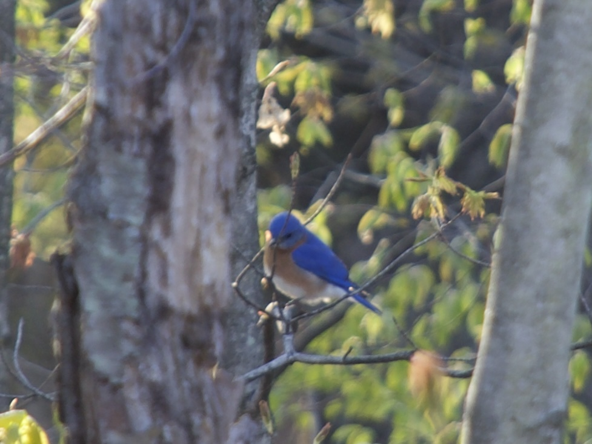
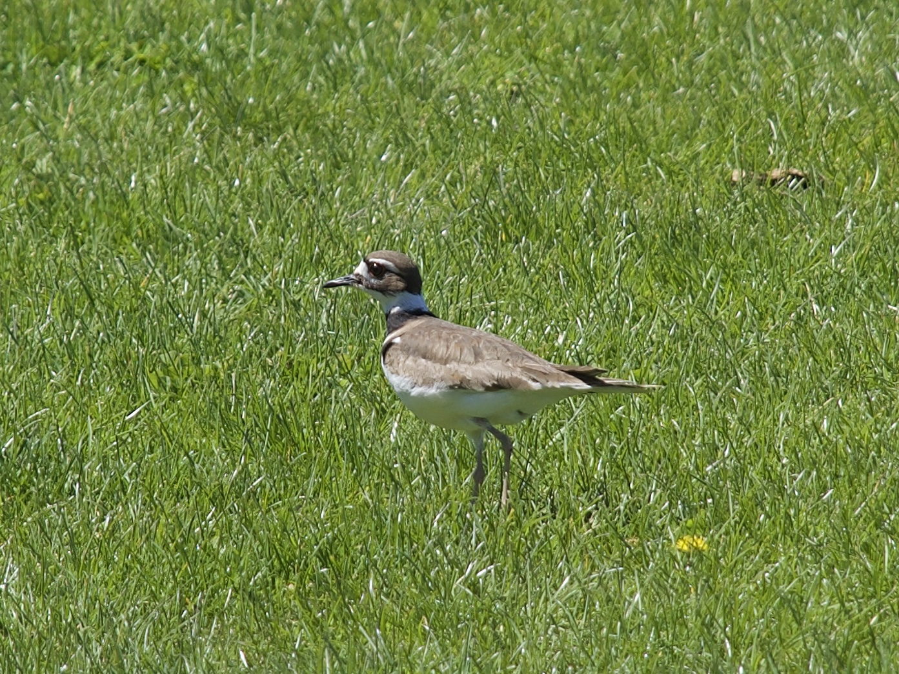
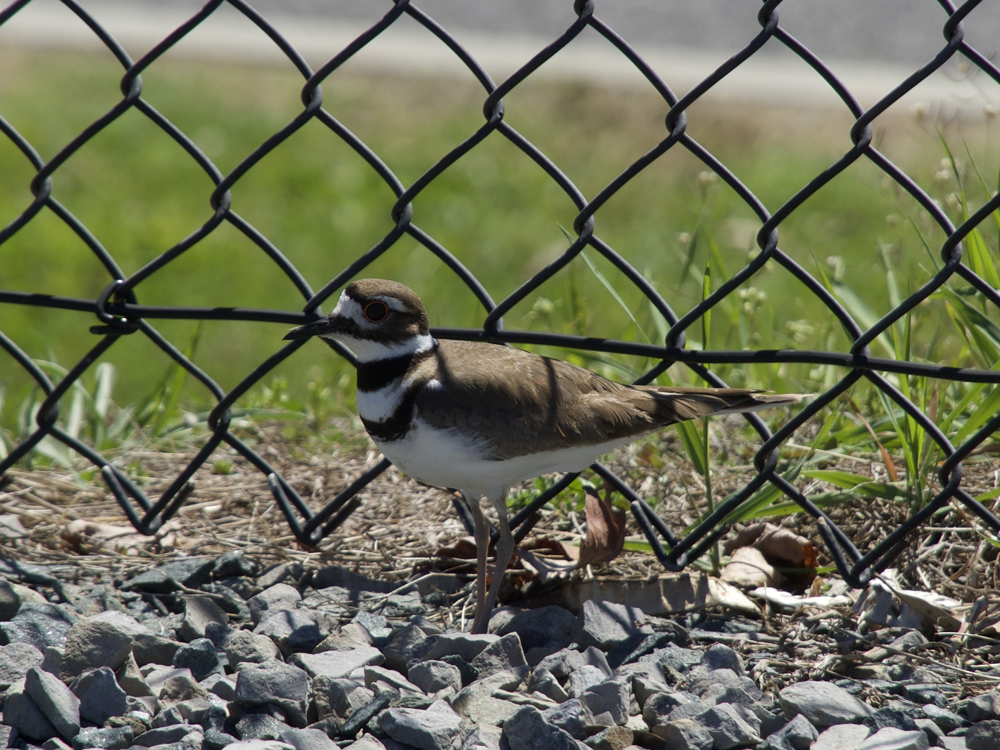
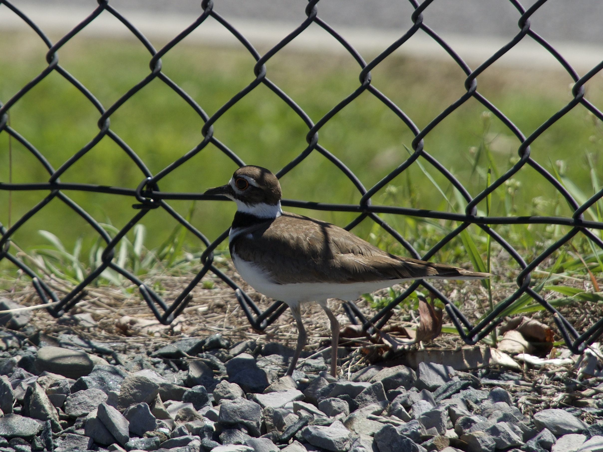
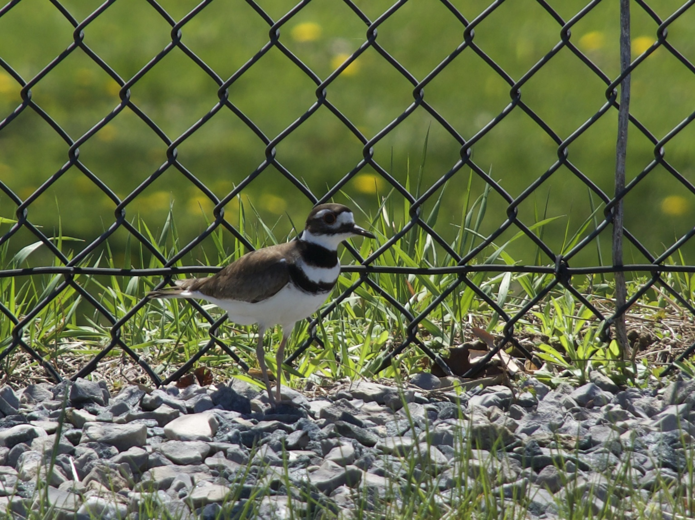
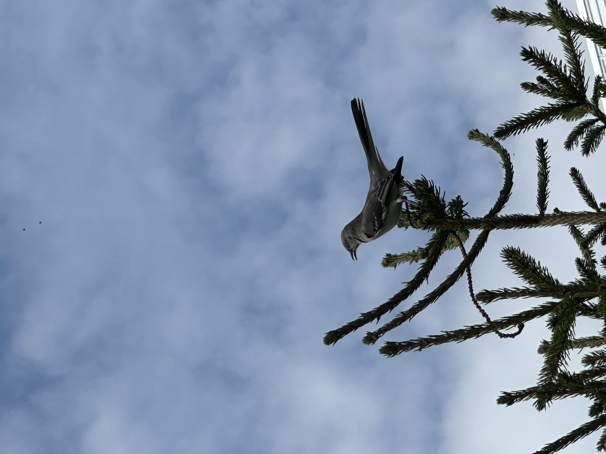
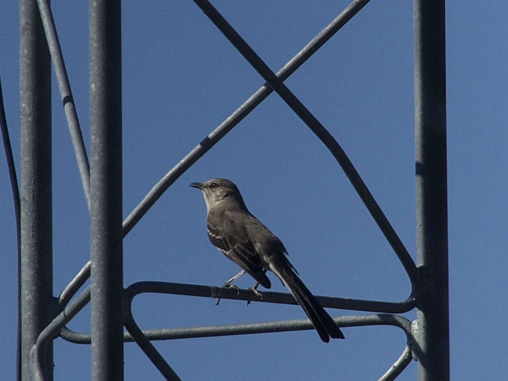
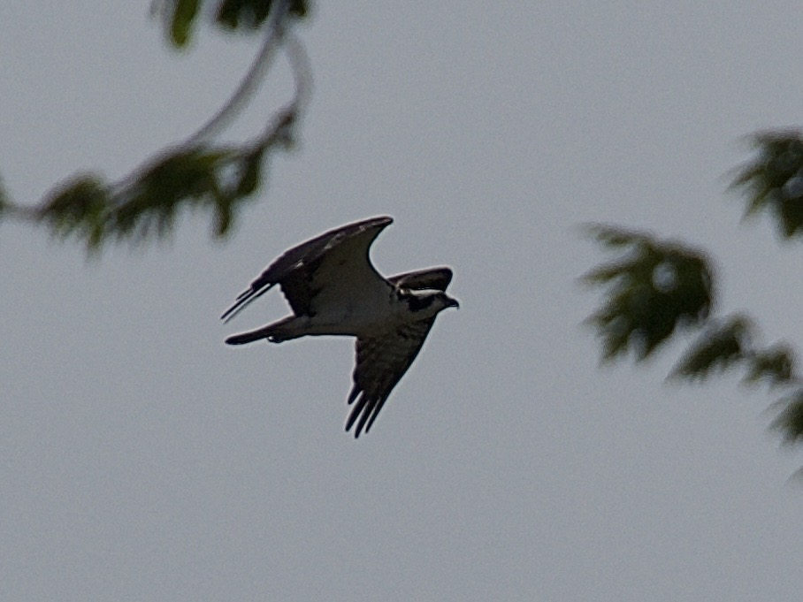
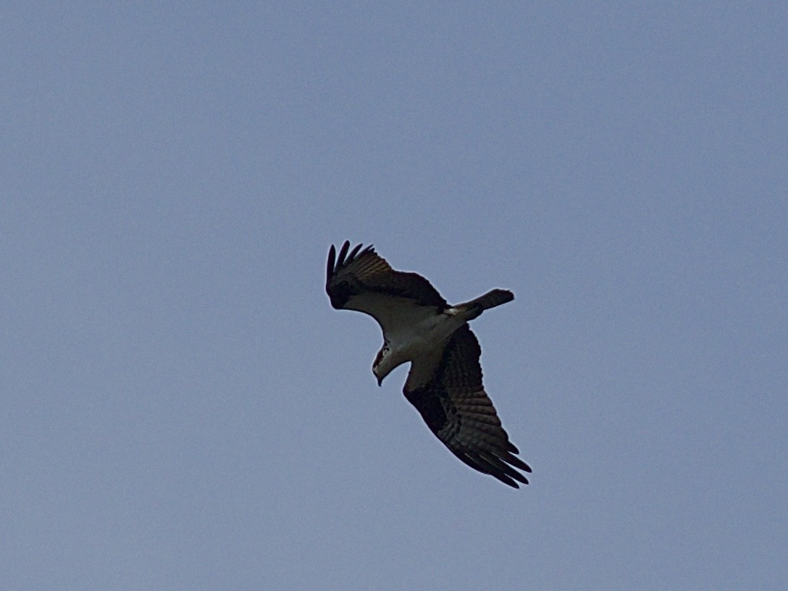
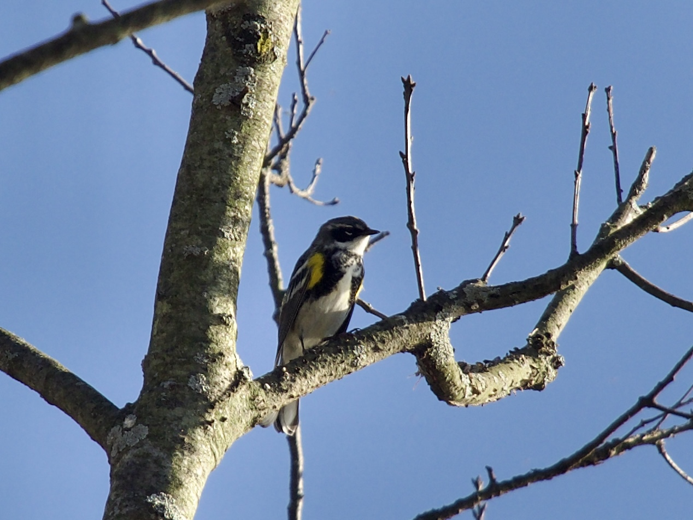

Welcome to the bird blog! This is a collection of bird pictures I have accumulated over the years and will periodically update. I have organized it alphabetically by the common name of the bird. Right click on the images to open them in full resolution.

## American Goldfinch 
<em> Spinus tristis </em> from Spinus (an Ancient Greek word for finch) and the Latin tristis for sad/sorrowful. This is a common botanical and zoological epithet for muted colors or, in this case, a reference to the dull plumage displayed in the winter compared to its bright summer yellow.

<em> Adult Male - Peebles Island State Park, Cohoes, NY [4/24/26] </em>

## Bald Eagle 
<em> Haliaeetus leucocephalus </em> from the Greek hali (sea), aeetos (eagle), leukos (white), and cephalos (head). 

 

<em> Adult-Peebles Island State Park, Cohoes, NY [4/24/26] </em>

<em> Juvenile - Green Island, NY [4/23/26] </em>

## Black-capped Chickadee
<em> Poecile atricapillus </em> from the Greek poikil (spotted or many-colored) and the Latin ater (black) and capillus (hair, particularly of the head).

<em> Adult - Peebles Island State Park, Cohoes, NY [4/24/26] </em>

  
## Blue Dacnis
<em> Dacnis cayana </em> from the Greek daknis, referring to an unidentified Egyptian bird mentioned by ancient writers Hesychius of Alexandria and Sextus Pompeius Festus and Cayenne (French Guiana), a common location reference for species found in the Amazon region.

<em> [Left] Male - PETAR, Iporanga, Sao Paulo, Brazil [8/10/23] </em>

## Blue Jay
<em> Cyanocitta cristata </em> from the Greek kyanos (dark or bright blue) and kitta (chattering bird/jay) and the Latin cristata (crested).

 

<em> Adult - SUNY Albany, Albany, NY [4/23/26] </em>

## Downy Woodpecker
<em> Dryobates pubescens </em> from the Greek drus (tree or woodland) and bates (walker or treader) and the Latin pubescens (covered in short hair i.e. downy).

 

 

<em> Adult Female (eastern) - Peebles Island State Park, Cohoes, NY [4/24/26] </em>

## Eastern Bluebird
<em> Sialia sialis </em> from the Greek sialis (often interpreted as a "bird" or a blue-colored bird like a thrush).

<em> Adult Male - Peebles Island State Park, Cohoes, NY [4/24/26] </em>

## Eurasian Coot 
<em> Fulica atra </em> from Latin fulica (coot) and atra (black, dark, gloomy).

<em> Adult - Lake Kawaguchi, Fujikawaguchiko, Japan [12/19/24] </em>

## Great Blue Heron
<em> Ardea herodias </em> from the Latin word for heron (Ardea) and the Ancient Greek word for heron (erōdios).

<em> [Right] Great Blue- Troy, NY [5/21/25] </em>

## Green-headed Tanager
<em> Tangara seledon </em> from the Tupi language word tangara (roughly translates to dancer) and the Greek chelidon or chelidonos, meaning a swallow.

<em> [Right] Adult - PETAR, Iporanga, Sao Paulo, Brazil [8/10/23] </em>

## Killdeer 
<em> Charadrius vociferus </em> from the Ancient Greek kharadrios a bird found in ravines and river valleys (kharadra meaning ravine) and the Latin vox (cry) and ferre (to bear). 

<em> Adult - SUNY Albany, Albany, NY [4/27/26] </em>

## Mallard
<em> Anas platyrhynchos </em> from the Latin for duck (anas), platus (flat), and rhynchos (bill, beak, snout).

<em> Adult Female (left) and Male (right) - Lake Kawaguchi, Fujikawaguchiko, Japan [12/19/24] </em>

<em> Adult Males - Peebles Island State Park, Cohoes, NY [4/24/26] </em>

## Mourning Dove
<em> Zenaida macoura </em> named to commemorate Zénaïde Bonaparte, the niece of Napoleon Bonaparte and the Ancient Greek makros (long/large) and oura (tail).

 

<em> Adult - Nassau County, NY [8/4/23] </em>

## Northern Cardinal
<em> Cardinalis cardinalis </em> from the Latin cardinalis, meaning "principal," "chief," or "essential," derived from cardo ("hinge"). The term was applied to high-ranking Roman Catholic officials ("hinge men") who held critical, central roles in church governance, often donning red to symbolize their dedication. Early North American settlers and naturalists named the bird "cardinal" due to this visual association between the male’s bright red color and the church official’s vestments.

<em> Male - Green Island, NY [4/23/26] </em>

## Northern Mockingbird
<em> Mimus polyglottos </em> from the Latin mimus (mimic, imitator, or actor) and the Ancient Greek poluglottos (many tongued).

<em> Adult - SUNY Albany, Albany, NY [4/14/26] Adult - SUNY Albany, Albany, NY [4/27/26] </em>

## Northern Yellow Warbler 
<em> Setophaga aestiva </em> from the Ancient Greek ses (moth) and phagos (eating) and the Latin aestivus (of summer/summer-like).

 

 

<em> Adult Male - SUNY Albany, Albany, NY [4/22/26] </em>

## Osprey
<em> Pandion haliaetus. </em> Pandion refers to a mythical Athenian King (Pandion II), whose daughters were turned into birds to escape torture, while haliaetus stems from the Ancient Greek haliaietos (from halos "sea" and aetos "eagle"). 

 

<em> Adult - Green Island, NY [4/23/26] </em>

## Red-winged Blackbird
<em> Agelaius phoeniceus </em> from the Ancient Greek agelaios which means "belonging to a flock" or "gregarious" and the Greek phoinikeos or Latin phoeniceus, meaning "crimson" or "scarlet". This is related to the Phoenicians, known for their production of reddish-purple dyes. 

 

<em> Adult Male - Van Schaick Island, NY [4/23/26] </em>

## Spot-biled Toucanet
<em> Selenidera maculirostris </em> from the Ancient Greek words selēnē (moon) and dera (neck) and the Latin macula (spot or stain) and rostris (billed or beak).

 

<em> Male - PETAR, Iporanga, Sao Paulo, Brazil [8/10/23] </em>

## Yellow-rumped Warbler
<em> Setophaga coronata </em> from the Ancient Greek ses (moth) and phagos (eating) and the Latin coronatus (crowned). 

<em> Adult Male (Myrtle) - Peebles Island State Park, Cohoes, NY [4/24/26] </em>

  
