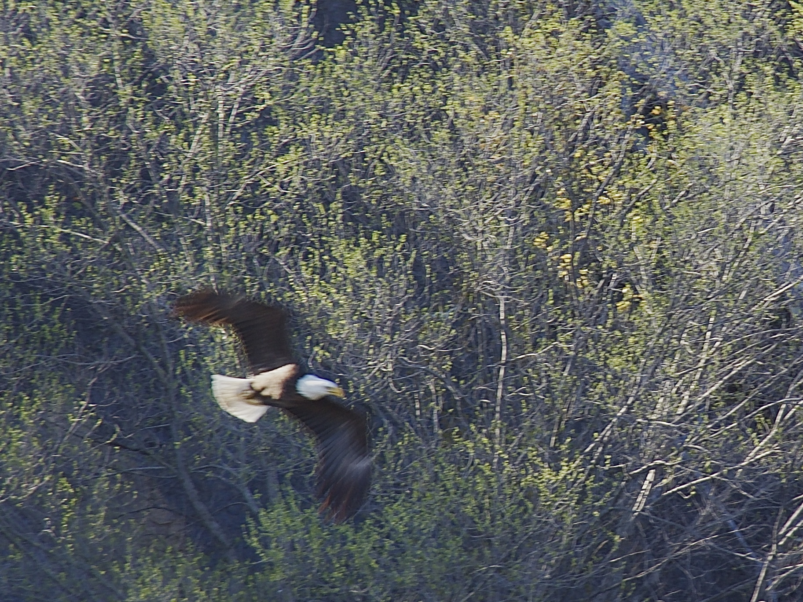
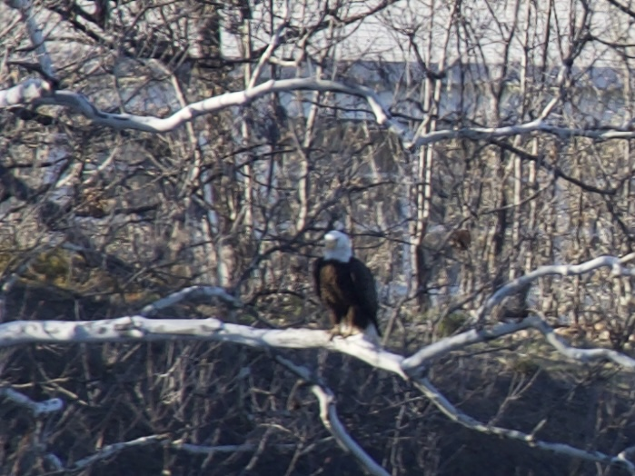
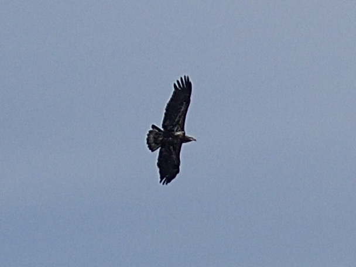

Welcome to the bird blog! This is a collection of bird pictures I have accumulated over the years and will periodically update. I have organized it alphabetically by the common name of the bird. Right click on the images to open them in full resolution.

## Bald Eagle 
<em> Haliaeetus leucocephalus </em> from the Greek hali (sea), aeetos (eagle), leukos (white), and cephalos (head). 

 

<em> Adult-Peebles Island State Park, Cohoes, NY [4/24/26} </em>

<em> Juvenile-Green Island, NY [4/23/26} </em>

