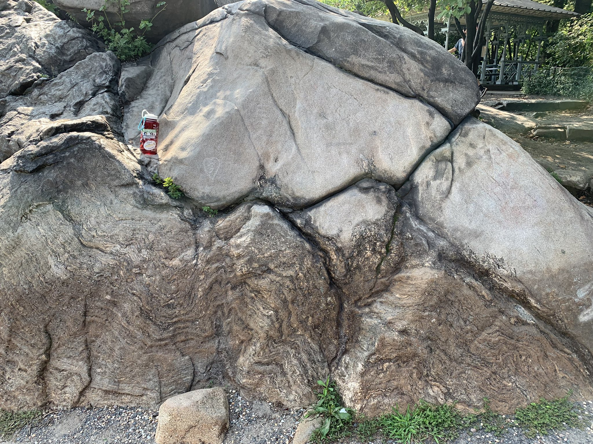
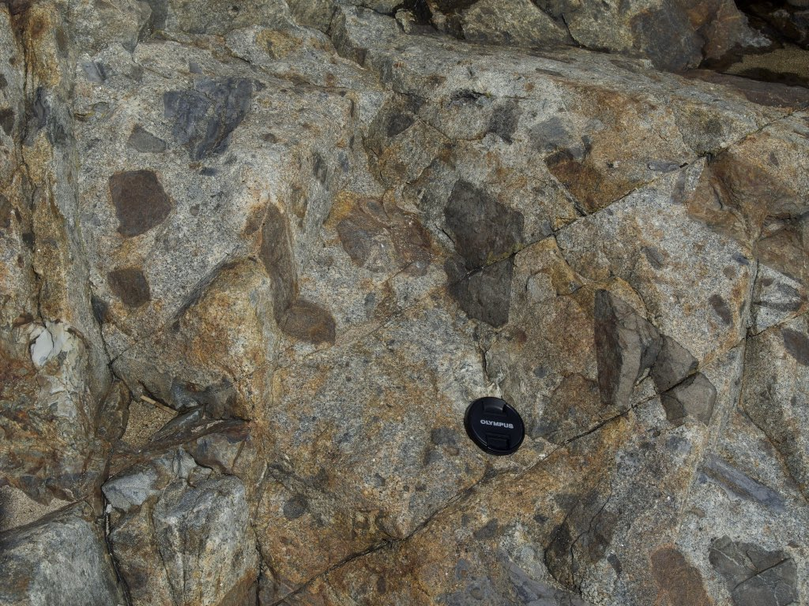

# Cool Outcrops and Rocks
In undergrad I studied geology more than anything and I still carry that passion into my graduate studies. Through my time at [Union College](https://www.union.edu/geology) I not only learned a lot about the geosciences, but was also able to get tons of amazing first-hand experience in the field. Through field trips, both in and out of college, I have amassed a collection of interesting hand specimens and field images. This page will serve as a way to curate that collection. Do note that I am most active on twitter so a lot of these links will send you to my twitter threads.

## [Geology of Central Park, NYC](https://twitter.com/plumquat/status/1430973196837269506?s=20&t=C_d62mw0KZ9cgxqMZuWXRg) 
The linked thread is one of my favorite trips. Growing up around NYC was an amazing experience but we do not get too many rocks, at least rocks that are uncovered and easily accessible. Central Park serves as one of the best places to see bedrock outcrops, especially in Manhattan. In this trip I followed a recent paper published by [Jaret et. al. 2021](https://par.nsf.gov/servlets/purl/10232156), which outlined some interesting new developments in our understanding of the geology of central park. This study was unique in its geochemical approach to trying to decipher the provenance (more or less source of the material) of the rock units that make up the bedrock of NYC. Outside of the technical details, the paper also functions as an excellent field trip guide. If you are visiting NY, wanting to learn more about your own backyard, or are an educator interested in local geology I would highly recommend reading it.

 

 
 
<em> Image of an outcrop of what is mapped as the Hartland Formation with a dyke intruding on top of it</em>

 
## [Geology of Acadia National Park](https://twitter.com/plumquat/status/1429154183387750405?s=20&t=H3uVzCO9f-hzv9bZJgW4Ug)
This is another twitter thread but with much more detail. In the summer of 2021, my girlfriend and I traveled to Acadia National Park and I had a ball looking at all the rocks. I spent much of the drive-up reviewing material from info that I had printed out and books that I had purchased so I went into the trip eager to see these things. This was by far one of my favorite trips. 

 
 
<em> An outcrop of the "Shatter Zone" at Sand beach. This is believed to be the remnants of the roof of an ancient
 magma chamber that collapsed in on the magma, which serves as the matrix supporting the clasts in the breccia! </em>

