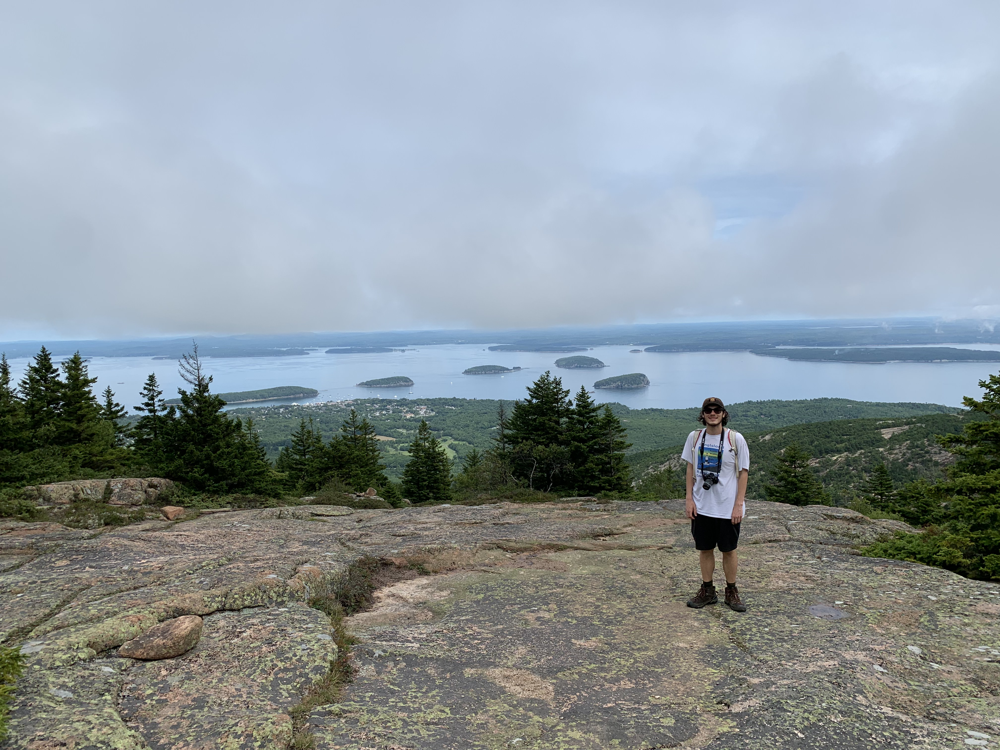
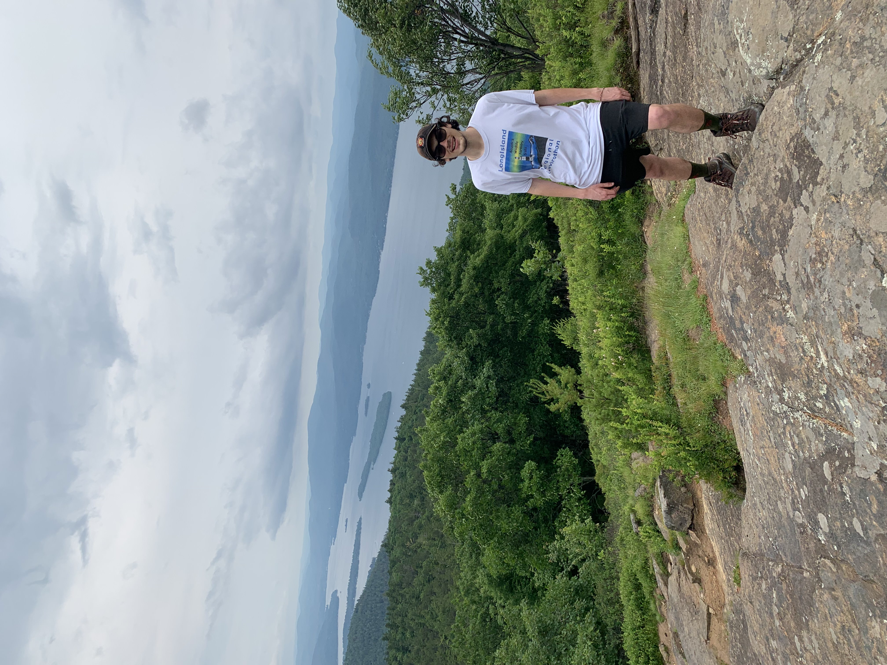
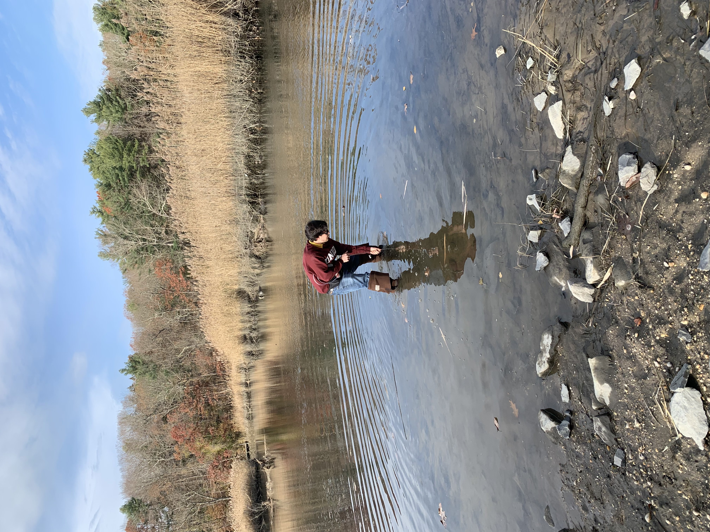
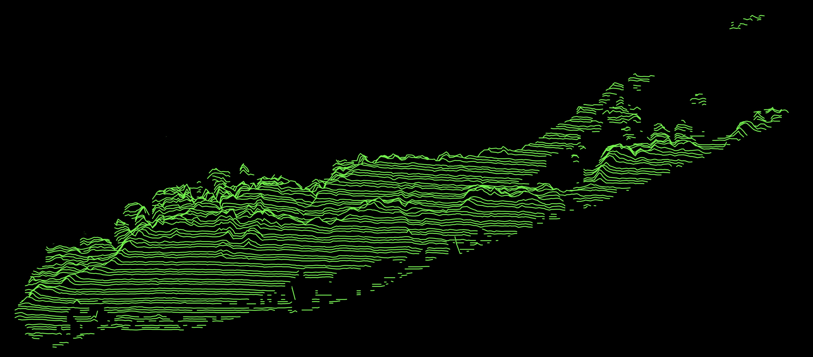

# Welcome to my page!
  
Here I will be posting little bits about my research and other projects that I find interesting. Throughout this website you will find links to various things I have created, curated, or otherwise been a part of. 

This is all fairly rudimentary as a result of my simple HTML and CSS skills but I plan on revamping it as I learn more. I'm a major proponent of free and easily accessible data and code, thus everything on here is for the taking. Occasionally ill have to only post graphs or images due to legal reasons. 

# About Me

I'm a PhD student working in the Paleoclimate Lab of the University at Albany in New York. My PhD research focuses on using coral records from the Red Sea to reconstruct sea surface temperature, sea surface salinity, circulation, regional wind phenomena, and more! I have also done work on speleothems from the Peruvian Andes, where I used oxygen isotopes to reconstruct monsoon variation from 135 ka to 160 ka. Outside of paleoclimate im broadly interested in geology, hydrology, and weather. 

 
 

# Links!

## Research 
[Coral Paleoclimate @ UAlbany](ulab.md)

[Undergrad Thesis on Peruvian Speleothems](Final_Project_Plummer.html) 

## Geoscience Stuff
[Cool Outcrops and Rocks](coar.md)

Monthly NY Climate Reports

Geology of New York State

2022 Mohawk River Ice Jams 

May 2022 Flooding in Schenectady

## Miscellaneous
The 1920 Agrarian Movement in Sant'Apollinare Italy

## Socials
[Twitter](https://twitter.com/plumquat)

[Instagram](https://www.instagram.com/plummquat/?hl=en)

[UAlbany GSEU](https://twitter.com/ualbanygseu) (I dont run this one)

  
  

  
