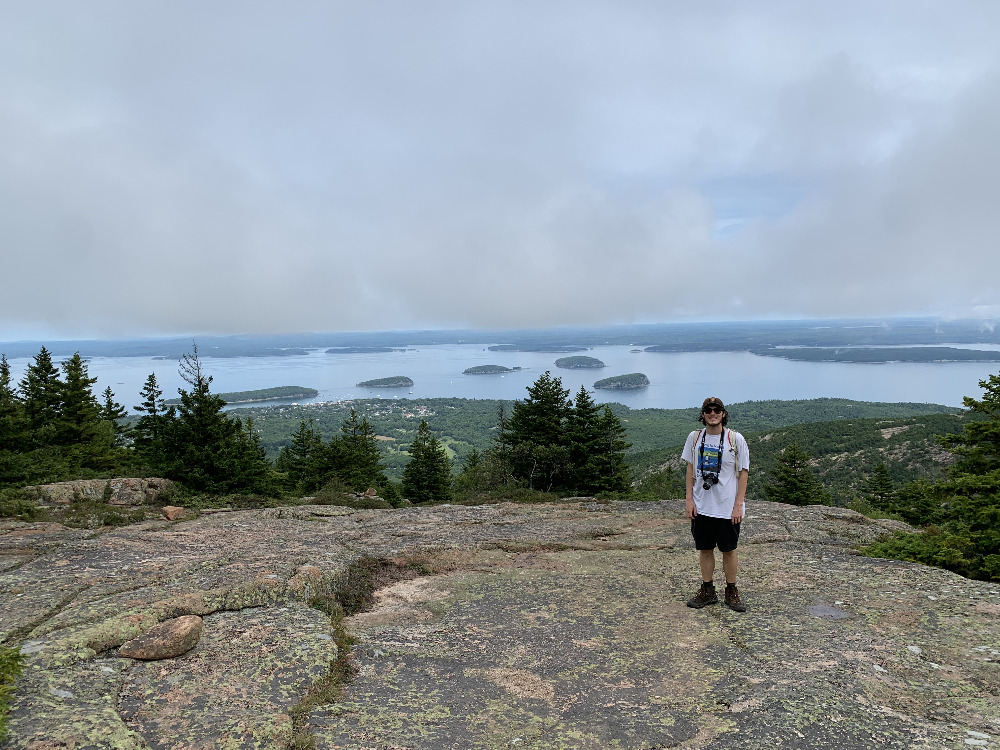
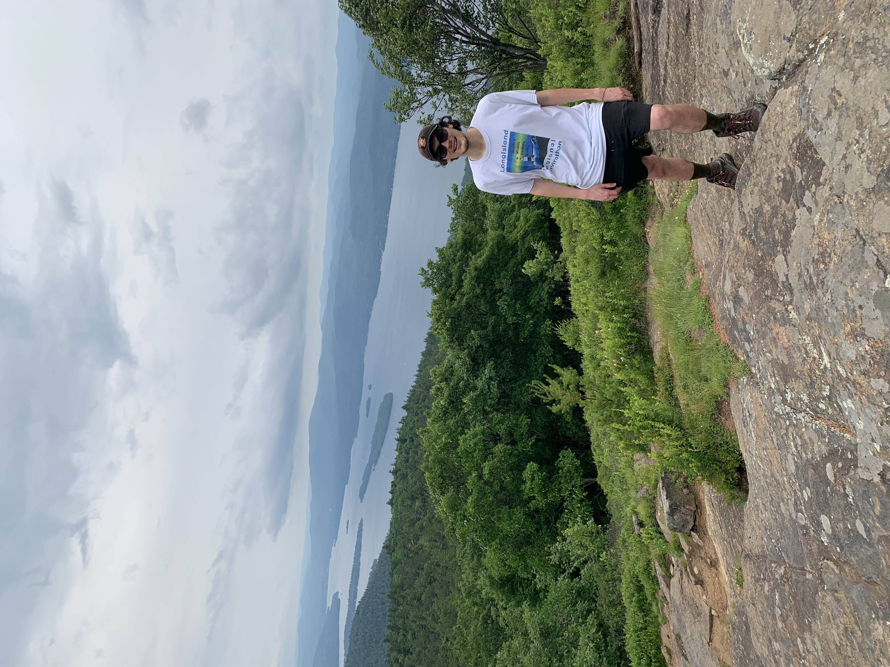
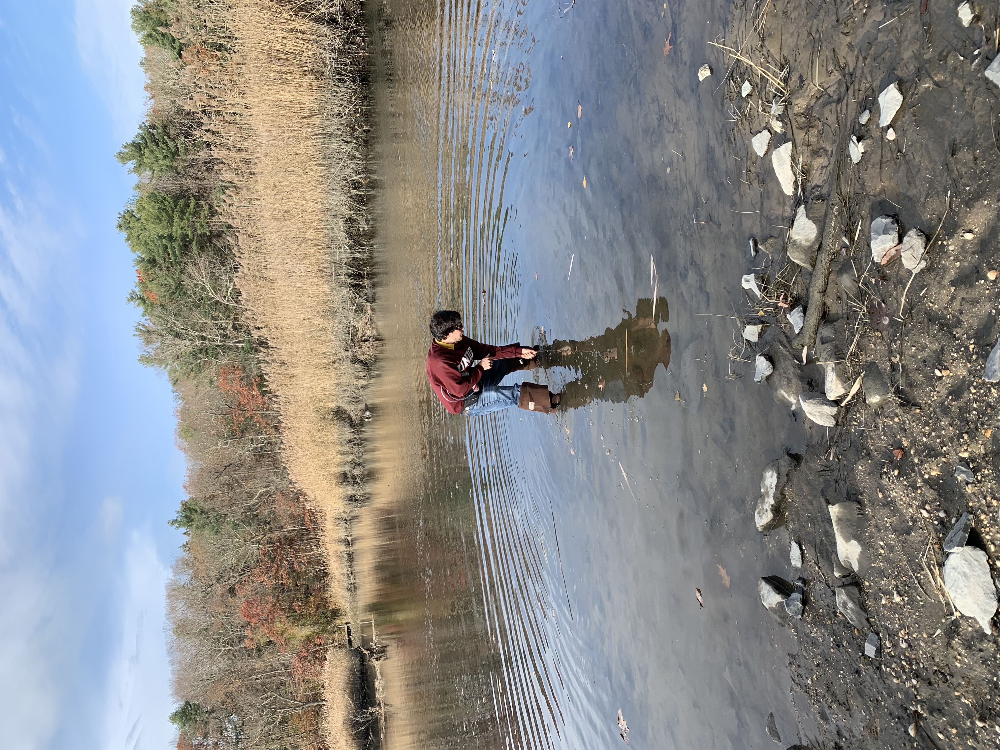

# Welcome to my page!
  
Here I will be posting little bits about my research and other projects that I find interesting. Throughout this website you will find links to various things I have created, curated, or otherwise been a part of. 
 
# About Me

I'm a PhD student working in the Paleoclimate Lab of the University at Albany in New York. My PhD research focuses on using coral records from the Red Sea to reconstruct sea surface temperature, sea surface salinity, circulation, regional wind phenomena, and more! I have also done work on speleothems from the Peruvian Andes, where I used oxygen isotopes to reconstruct monsoon variation from 135 ka to 160 ka. Outside of paleoclimate im broadly interested in geology, hydrology, and weather. 

 
 

# Links!

## Research 
[What role does ENSO play in the relationship between the NAO and Red Sea SST?](https://link.springer.com/article/10.1007/s00382-025-07894-3)

## Climate and Geoscience Stuff

[Professor Proxy](PP.html) 

[Japanese Temperature Trends](JapanTempTrends.html)

[Japanese ENSO Response](ENSO_Maps_Temp.html)

[Interactive Maps](Figs.md)

[Cool Outcrops and Rocks](coar.md)

[April 2022 Flooding in Schenectady](apr22flood.md)

[May 2022 Flooding in Schenectady](mayflood.md) 

## Coding Guides

[Downloading and Graphing Data from Davis WeatherLink](DWL.html)

[Extracting SST Time Series from NOAA OISST Data](HROISST.html) 

[Creating Probability Density Functions in R](PDFs.html) 

## Socials
[Bluesky](https://bsky.app/profile/iplumm.bsky.social)

[Twitter](https://x.com/plumquat)

[StoryGraph](https://app.thestorygraph.com/profile/plummquat?redirect=true)

[Google Scholar](https://scholar.google.com/citations?hl=en&user=XXYy0TcAAAAJ)

[eBird](https://ebird.org/profile/OTE0ODAwMg)

## Miscellaneous
[Bird Blog](birds.md)

  
