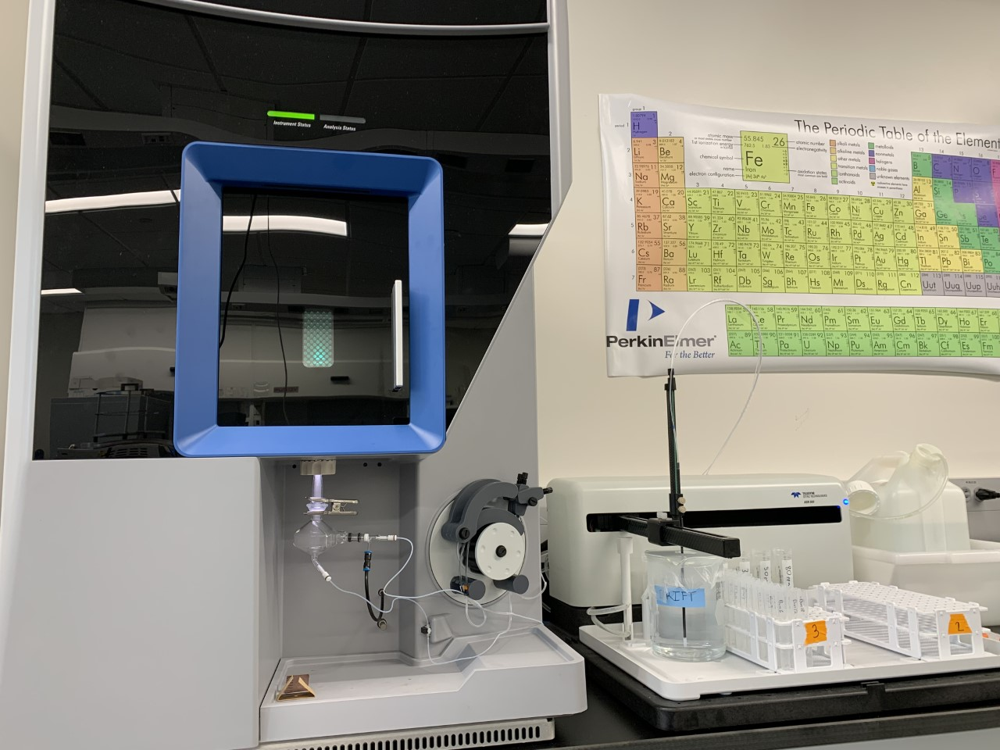

# Paleoclimate Lab, University @ Albany

I am currently working in the brand new Paleoclimate Lab at the University at Albany, which is run by Dr. Sujata Murty and Dr. Aubrey Hillman. The lab is set up for coral and lake core analysis, although most of what I highlight here will be about the coral side of the lab. 

I know it isn't the prettiest way to design this but the headers serve as links to dedicated pages about each of these topics. Thus, if you want to know more simply click on the header.

## [ICP-OES](icpoes.md)
The centerpiece of the lab is a brand new Thermo Scientific iCAP PRO Series ICP-OES (Inductively Coupled Plasma- Optical Emission Spectroscopy), which we are using to analyze concentrations of strontium (Sr), magnesium (Mg), calcium (Ca), and barium (Ba) in coral powder samples. We are also analyzing a slew of other elements on the lake core side of things. 

 

## Research
Broadly, our goal is to reconstruct a number of conditions in and around the Red Sea using geochemical tracers within coral skeletons. Our work will hopefully shed light on spatial and temporal variation in sea surface temperature, sea surface salinity, the Red Sea overturning circulation, dust deposition from wind, and more. We are also looking to analyze patterns in any of these parameters to tease out the possible effects of internal variability such as ENSO, IOD, NAO/AO, AMO, and more! 

As coral’s grow, they secrete a calcium carbonate (CaCO3) skeleton. This process “traps” other elements such as Sr, Mg, and Ba. The controls on how much of each of these elements are incorporated into the coral skeleton is a product of a number of processes, come of which are highlighted in the dedicated page. We can analyze the concentrations of these elements on the ICP-OES and then construct a time series to see how the concentrations of these elements change with time. 

We are also working in collaboration with the [Union College Stable Isotope Mass Spectrometer Lab](https://minerva.union.edu/gillikid/lab.htm) in Schenectady to get oxygen and carbon stable isotope records to coincide with the Sr, Mg, and Ba concentrations. This will allow us to directly reconstruct sea surface temperature and salinity (info on how this works found on the dedicated page). 

## Publications
Stay tuned!!

