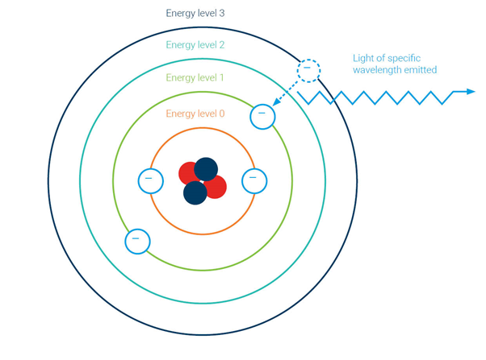

# Paleoclimate Lab, University @ Albany

I am currently working in the brand new Paleoclimate Lab at the University at Albany, which is run by Dr. Sujata Murty and Dr. Aubrey Hillman. The lab is set up for coral and lake core analysis, although most of what I highlight here will be about the coral side of the lab.

## [ICP-OES]()
The centerpiece of the lab is a brand new Thermo Scientific iCAP PRO Series ICP-OES (Inductively Coupled Plasma- Optical Emission Spectroscopy), which we are using to analyze concentrations of Strontium (Sr), Magnesium (Mg), Calcium (Ca), and Barium (Ba) in coral powder samples. We are also analyzing a slew of other elements on the lake core side of things. 

  

ICP-OES is a method of measuring the concentrations of various elements in a given sample. This is done by first dissolving the sample (most often in acid) and then nebulizing said sample so that it can be introduced to an energy source. In the case of the iCAP PRO, the energy source is a plasma created by using Argon gas. This plasma is generally operating at 10,000 Kelvin, which is almost 2x hotter than the surface of the sun! 

When the nebulized sample enters the plasma it becomes energized, so much so that valence electrons will “jump up” an orbital, thus entering an “excited” state. As the excited sample moves into the cooler portions of the plasma, the valence electrons will return to their original lower energy state. In doing this, the atoms release energy. This released energy has a wavelength that is unique to each element, which makes it possible for us to detect what elements are present in a given sample. The intensity of energy at each wavelength can then be converted into a concentration value. 

   <em> Image taken from Agilent showing the emission of energy at a specific wavelength </em>

I won’t go into too much detail about the processes so as to not bore you or distract from the rest of what I want to show off. However, if you are interested in learning more [agilent](https://www.agilent.com/en/support/atomic-spectroscopy/inductively-coupled-plasma-optical-emission-spectroscopy-icp-oes/icp-oes-faq) has a great page that can get you started. 

### Path of Sample Introduction
The process of nebulizing the sample begins all the way to the right of the above image. That black bar with the tube sticking out is the Sipper Probe. This piece draws out the sample, which has been dissolved in acid (see more about sample prep below) and brings it to the left of the frame. 

The black and white wheel with the gray clamps on top is the peristaltic pump, which is what is responsible for maintaining and regulating flow in this system. The liquidized sample moves through the tubing, past the pump and into the small class piece known as the nebulizer (seen with the white and black tubing sticking out of it). This image does not do justice to the fragility of this piece. As the liquid sample moves through the capillary in the nebulizer it mixes with argon (being supplied by the black tube) and turns the liquid sample into an aerosol.

The aerosols then move into the cyclonic spray chamber (the large glass piece with the white tube sticking out from the bottom), which acts as a separator of the larger and smaller aerosols. Larger aerosols fall out and flow down the drain on the bottom, while finer aerosols flow upwards into the plasma (the faint greenish glow can be seen through the window on the body of the machine. 

 
